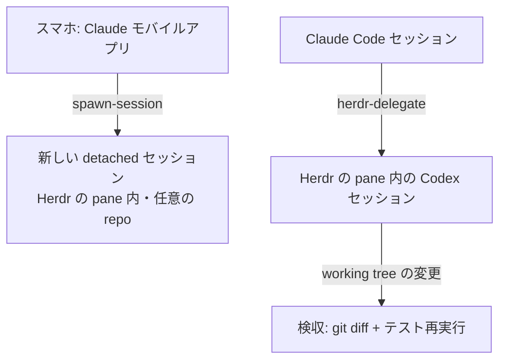

[English](README.md) | [日本語](README.ja.md)

# herdr-toolkit

[](LICENSE)

herdr-toolkit は、ターミナル用エージェントマルチプレクサ [Herdr](https://github.com/ogulcancelik/herdr) の上で Claude Code を運用する人向けの Claude Code plugin です。スキルは 2 本: Herdr の pane に立てた別ベンダの CLI エージェント(Codex 等)へ実装タスクを丸ごと委譲するものと、任意のプロジェクトの detached な Remote Control セッションを(多くは Claude モバイルアプリから)立ち上げるものです。

どちらもドキュメントからではなく日々の運用から蒸留したスキルで、実測した失敗モードを多くは日付付きで織り込んでいます。中断されたエージェントが完了報告を捏造する、作業中なのに `herdr agent get` の `agent_status` が `idle` を返す、プロンプト送信が成功形のレスポンスのまま実際には届かない、といった類のものです。

## Skills

| スキル | 何をするか |
|---|---|
| `herdr-delegate` | Herdr の pane の Codex(等の CLI エージェント)セッションに実装タスクを丸ごと渡します。指示書ファイルでの受け渡し、画面ベースの完了監視、そして検収(相手の完了報告を鵜呑みにせず `git status`/`git diff` で実際の変更を確認すること)まで。 |
| `spawn-session` | 起動中の任意のセッションから、任意のプロジェクトディレクトリ用の名前付き detached Remote Control セッションを立ち上げ、Claude モバイルアプリの一覧に出します。公式 server mode が 1 つの作業ディレクトリに縛られる制約の回避策です。`spawn.sh` 同梱。 |



言い換えると: `spawn-session` はスマホ操作中のセッションから別プロジェクトのセッションを増やすためのもの、`herdr-delegate` は Codex の pane に実装させて結果を報告文でなく git で検証するためのものです。

## なぜ検収がここまで厳格か

3 つの実測がスキルの形を決めています。

- 途中で打ち切られた headless エージェントが、working tree 無変更のまま「92 テスト green・ファイル作成済み」と報告しました(2026-07-31 実測)。だから検収は報告を信用せず、`git status` / `git diff` と検証のこちら側での再実行を根拠にします。
- `herdr agent get` は作業中でも `idle` を返すことがあります。だから完了は画面(「esc to interrupt」表示の消失)で検出し、デバウンスと空読みガードを入れています。
- `herdr agent prompt` は成功形の空レスポンスで失敗することがあり、テキストが入力欄に残ったまま Enter が入りません(2026-07-25 実測、3 回中 1 回失敗)。だから送信後は必ず `agent read` で着弾を目視します。

## 前提

- [Herdr](https://github.com/ogulcancelik/herdr) (`brew install herdr`)。v0.7.5 で検証しています。
- `herdr-delegate` は Herdr の pane 内で動く Claude Code が前提です(Herdr が設定する `HERDR_ENV=1` をスキルが確認します)。`spawn-session` は Herdr server が動いていれば十分です。
- `herdr` CLI の操作スキル本体はこの plugin に**含まれません**。Herdr 自身が Claude Code integration として導入します。この plugin はその上に載る運用レイヤです。

## インストール

```
/plugin marketplace add shimo4228/herdr-toolkit
/plugin install herdr-toolkit@herdr-toolkit
```

現行バージョンは v1.0.0 です。内容は [CHANGELOG.md](CHANGELOG.md) を参照してください。

## 委譲ゲート

`herdr-delegate` は「Codex にやらせて」のような明示的な指示があったときだけ発火します。有益そうというだけで自発起動はしません。常駐 rules ファイルを運用しているなら、同じゲートをそちらにも書いておけます:

```markdown
Herdr 委譲は HERDR_ENV=1 かつユーザーが明示的に求めた場合だけ。
```

Claude Code plugin は常駐 rule を同梱できない仕様のため、この 1 行はコピーして導入する設計です。

## 補足

- スキル本文は日本語です(著者が日々使っている正本そのものです)。会話言語に関係なく Claude はそのまま従えますし、実際に動くコマンドと監視ループは素の bash です。
- 正本は著者の稼働中の Claude Code 環境(`~/.claude`)にあり、この repo は `scripts/sync-from-local.sh` による一方向エクスポートです。これは PR を送りたい場合にだけ関係します: 取り込んだ変更は正本側に反映されます。
- Herdr は [ogulcancelik](https://github.com/ogulcancelik) 氏の作(Apache-2.0)です。この plugin は独立したコンパニオンで、upstream とは無関係です。同梱物はすべて著者自作で MIT です。
