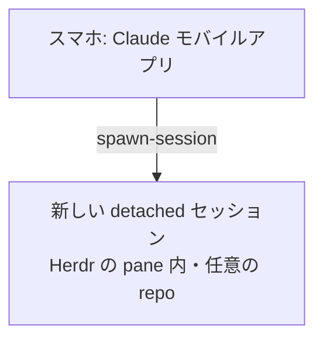

[English](README.md) | [日本語](README.ja.md)

# herdr-toolkit

[](LICENSE)

herdr-toolkit は、ターミナル用エージェントマルチプレクサ [Herdr](https://github.com/ogulcancelik/herdr) の上で Claude Code を運用する人向けの Claude Code plugin です。スキルは `spawn-session` の 1 本で、任意のプロジェクトの detached な Remote Control セッションを(多くは Claude モバイルアプリから)立ち上げます。

ドキュメントからではなく日々の運用から蒸留したスキルで、実測した失敗モードを多くは日付付きで織り込んでいます。`herdr agent get` の `agent_status` ではプロンプトが届いたか分からない、プロンプト送信が成功形のレスポンスのまま実際には届かない、作業中に送ったプロンプトが黙って落ちる、といった類のものです。

## Skills

| スキル | 何をするか |
|---|---|
| `spawn-session` | 起動中の任意のセッションから、任意のプロジェクトディレクトリ用の名前付き detached Remote Control セッションを立ち上げ、Claude モバイルアプリの一覧に出します。公式 server mode が 1 つの作業ディレクトリに縛られる制約の回避策です。`spawn.sh` 同梱。 |


```mermaid
flowchart TD
    P[スマホ: Claude モバイルアプリ] -->|spawn-session| S[新しい detached セッション<br>Herdr の pane 内・任意の repo]
```

言い換えると: `spawn-session` はスマホ操作中のセッションから別プロジェクトのセッションを、それぞれ Herdr の pane に増やすためのものです。

## なぜ送信のたびに着弾を確かめるか

立ち上げたセッションに最初の仕事を渡すとき、3 つの実測が効きます。

- 起動直後の agent への `herdr agent prompt` は成功形の空レスポンスで失敗することがあり、テキストが入力欄に残ったまま Enter が入りません(2026-07-25 実測、3 回中 1 回失敗)。だから送信後は必ず `agent read` で pane を見て着弾を確かめます。
- `agent_status` だけでは着弾が分かりません。`done` は「即答して応答待ち」でも返ります。だから判定はステータスでなく画面で行います。
- `working` 中に送ったプロンプトは黙って落ちます(2026-09-23 実測、3 回)。だから `idle` か `done` を待ってから送ります。

## 前提

- [Herdr](https://github.com/ogulcancelik/herdr) (`brew install herdr`)。v0.7.5 で検証しています。
- `spawn-session` は Herdr server が動いていれば十分です(無ければ `spawn.sh` が headless で起動します)。呼び出し元のセッションが Herdr の pane 内で動いている必要はありません。
- `herdr` CLI の操作スキル本体はこの plugin に**含まれません**。Herdr 自身が Claude Code integration として導入します。この plugin はその上に載る運用レイヤです。

## インストール

```
/plugin marketplace add shimo4228/herdr-toolkit
/plugin install herdr-toolkit@herdr-toolkit
```

現行バージョンは v2.0.0 です。内容は [CHANGELOG.md](CHANGELOG.md) を参照してください。

## 補足

- スキル本文は日本語です(著者が日々使っている正本そのものです)。会話言語に関係なく Claude はそのまま従えますし、実際に動くコマンドと監視ループは素の bash です。
- 正本は著者の稼働中の Claude Code 環境(`~/.claude`)にあり、この repo は `scripts/sync-from-local.sh` による一方向エクスポートです。これは PR を送りたい場合にだけ関係します: 取り込んだ変更は正本側に反映されます。
- Herdr は [ogulcancelik](https://github.com/ogulcancelik) 氏の作(Apache-2.0)です。この plugin は独立したコンパニオンで、upstream とは無関係です。同梱物はすべて著者自作で MIT です。
