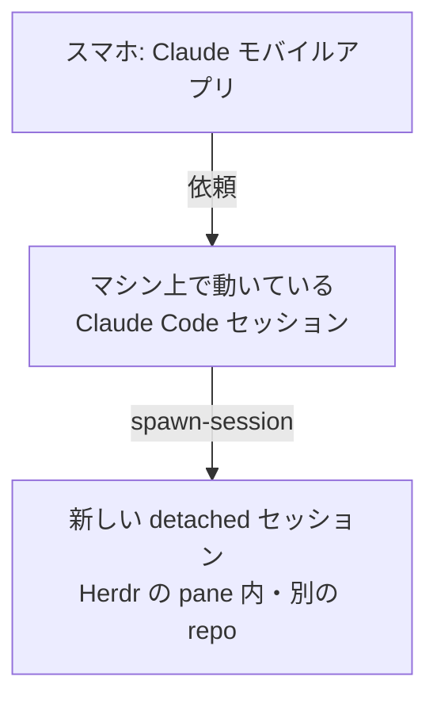

[English](README.md) | [日本語](README.ja.md)

# herdr-toolkit

[](LICENSE)

herdr-toolkit は、ターミナル用エージェントマルチプレクサ [Herdr](https://github.com/ogulcancelik/herdr) の上で Claude Code を運用する人向けの Claude Code plugin です。スキルは `spawn-session` の 1 本で、別のプロジェクトのディレクトリに新しい Remote Control セッション（Claude モバイルアプリから操作できる Claude Code のセッション）を立ち上げます。依頼は多くの場合スマホから出します。新しいセッションは detached で動きます。つまり専用の Herdr の pane の中にあり、ターミナルのウィンドウにはつながっていません。この運用を扱った記事と関連 repo は [著者のほかの仕事](#著者のほかの仕事) にあります。

ドキュメントからではなく日々の運用から蒸留したスキルで、実測した失敗モードを多くは日付付きで織り込んでいます。

## スキル

スキル本文は日本語です（著者が日々使っている版がそのまま入っています）。会話言語に関係なく Claude はそのまま従えますし、実際に動くコマンドと監視ループは素の bash です。

| スキル | 何をするか |
|---|---|
| `spawn-session` | 公式の Remote Control の server mode では全セッションが 1 つの作業ディレクトリに縛られる（2026-08-01 に公式 docs で確認）ので、その回避策です。起動スクリプト `spawn.sh` 同梱。 |


```mermaid
flowchart TD
    P[スマホ: Claude モバイルアプリ] -->|依頼| C[マシン上で動いている<br>Claude Code セッション]
    C -->|spawn-session| S[新しい detached セッション<br>Herdr の pane 内・別の repo]
```

言い換えると: スマホから、マシン上ですでに動いている Claude Code のセッションに頼むと、そのセッションが `spawn-session` を実行します。起動スクリプト `spawn.sh` は、そのリポジトリの Herdr の workspace に tab を開き（無ければ workspace を作り）、そこでセッション名を付けて `claude --remote-control` を起動し、idle になるまで待って、アプリで探すセッション名を表示します。`spawn.sh` が Claude Code に渡すフラグは `--model` だけなので、新しいセッションの permission mode は自分の設定どおりになります。またスクリプト自体はネットワーク通信をしません。

## なぜ送信のたびに着弾を確かめるか

立ち上げた後は、呼び出し元のセッションが、スキルの表示した Herdr の agent 名を使って `herdr agent prompt` で新しいセッションに最初の仕事を渡せます。その渡し方は、次の 3 つの実測をもとに決めています。

- 起動直後の agent への `herdr agent prompt` は、成功したように見える空のレスポンスを返したまま失敗することがあり、テキストが入力欄に残ったまま Enter が入りません（2026-07-25 実測、3 回中 1 回失敗）。だから送信後は必ず `agent read` で pane を見て着弾を確かめます。
- `agent_status`（Herdr が agent ごとに持つ状態の欄で、`working`・`idle`・`done` などの値をとります）だけでは着弾が分かりません。`done` は「即答して応答待ち」でも返ります。だから判定はステータスでなく画面で行います。
- `working` 中に送ったプロンプトは黙って落ちます（2026-09-23 実測、3 回）。だから `idle` か `done` を待ってから送ります。

## 前提

- claude.ai のサブスクリプションでログインした Claude Code が必要です。2026-10-10 時点の Anthropic の [Remote Control のドキュメント](https://code.claude.com/docs/ja/remote-control)では、対象は Pro・Max・Team・Enterprise プランで、API キーには対応していません（Team と Enterprise では先に Owner が Remote Control を有効にする必要があります）。スマホから立ち上げるなら Claude モバイルアプリも必要です。スキルを呼び出すために、そのマシンで Claude Code のセッションが少なくとも 1 つ動いている必要があります。
- [Herdr](https://github.com/ogulcancelik/herdr)（`brew install herdr`）。v0.7.5 で検証しています。著者はすべて macOS で動かしており、ここにあるインストール手順は Homebrew を前提にしています。
- `jq`（`brew install jq`）。無いと `spawn.sh` は止まります。
- Herdr が新しい pane で開くシェルの PATH に `claude` があること。無いと新しいセッションは起動せず、`spawn.sh` が idle に達しなかったと警告します。
- Herdr server を自分で起動しておく必要はありません（無ければ `spawn.sh` が headless で起動します）。呼び出し元のセッションが Herdr の pane 内で動いている必要もありません。
- Herdr 自身の `herdr` CLI 操作スキルはこの plugin に**含まれません**が、`spawn-session` はそれを必要としません。`spawn.sh` が `herdr` コマンドを直接呼ぶので、Herdr を入れておけば足ります。

## インストール

```
/plugin marketplace add shimo4228/herdr-toolkit
/plugin install herdr-toolkit@herdr-toolkit
```

続いて、リポジトリの置き場所をスキルに教えます。スキルはプロジェクトのディレクトリを `$CC_PROJECTS_ROOT` の下から探し、既定は `~/MyAI_Lab`（著者のフォルダ）です。シェルのプロファイルで export し、そのあとでスキルを呼び出す Claude Code のセッションを起動すると、セッションからこの値が見えます。

```bash
export CC_PROJECTS_ROOT="$HOME/code"   # 自分のリポジトリを置いているフォルダ
```

現行バージョンは v2.0.0 です。内容は [CHANGELOG.md](CHANGELOG.md)（英語）を参照してください。

動作を確かめるには、`$CC_PROJECTS_ROOT` の下にあって、このマシンで一度は Claude Code で開いたことのあるリポジトリを選びます。初めて開くリポジトリは workspace trust の確認ダイアログ（そのフォルダを信頼するかを Claude Code が初回に尋ねる画面）で止まります。スマホから立ち上げた場合は pane の前に誰もいないので、その Herdr の pane に入って承認するまで先へ進みません。動いている Claude Code のセッションに、そのリポジトリでセッションを立てるよう頼みます（例:「my-repo のセッション立てて」）。スキルはセッション名を表示し、新しいセッションがその名前で Claude モバイルアプリのセッション一覧に出ます。あわせて表示される Herdr の agent 名は、呼び出し元のセッションが新しいセッションへプロンプトを送るときに使います。

## 補足

- 最新版は著者の稼働中の Claude Code 環境（`~/.claude`）にあり、この repo は `scripts/sync-from-local.sh` による一方向エクスポートです。これは PR を送りたい場合にだけ関係します: 取り込んだ変更は著者の環境側の版に反映されます。
- Herdr は [ogulcancelik](https://github.com/ogulcancelik) 氏の作（Apache-2.0）です。この plugin は Herdr を補う独立した別プロジェクトで、upstream とは無関係です。同梱物はすべて著者自作で MIT です。

## 著者のほかの仕事

- **[iPhone公式アプリでClaude Codeを運用する — 新セッション・再認証・git push、3つの穴の塞ぎ方](https://zenn.dev/shimo4228/articles/iphone-claude-code-remote-control)**（[English](https://dev.to/shimo4228/claude-code-from-iphone-plugging-3-holes-in-remote-control-17cf)）: `spawn-session` の出発点です。記事を書いた時点（2026 年 7 月）では既存のセッションにつなぐことしかできなかったスマホアプリから、新しいセッションを立てるための、tmux のワンライナーとして始まった経緯が分かります。
- **[AI エージェント版 tmux「herdr」— エディタが要らなくなるまで](https://zenn.dev/shimo4228/articles/herdr-agent-multiplexer)**（[English](https://dev.to/shimo4228/herdr-a-tmux-for-ai-agents-until-the-editor-disappeared-3hnn)）: Herdr の上でコーディングエージェントを日々動かす様子と、著者がこの運用を Herdr へ移した理由が分かります。
- **[claude-harness](https://github.com/shimo4228/claude-harness)**: 著者が毎日使っている Claude Code ハーネスの公開版です。`spawn-session` もここにあり、ほかの skill・subagent・rule・hook と並んでいて、1 つずつ持ち帰れます。
- **[harness-scope](https://github.com/shimo4228/harness-scope)**: グローバルな skill・agent・rule・tool を、名前付きの profile で repo ごとに on/off する Claude Code Mod（Claude Code 自体の振る舞いを変えるアドオン）です。
- **[shimo4228](https://github.com/shimo4228/shimo4228)**: 著者のハブです。長期プロジェクトと、その DOI があります。

## ライセンス

[MIT](LICENSE)

<details>
<summary>ツールと AI アシスタント向けの資料</summary>

herdr-toolkit は、ターミナル用エージェントマルチプレクサ Herdr の上で Claude Code を運用する人向けの Claude Code plugin です。スキルは `spawn-session` の 1 つで、`$CC_PROJECTS_ROOT` の下にある別のプロジェクトのディレクトリに、名前付きで detached な Claude Code Remote Control セッションを立ち上げます。依頼は多くの場合 Claude モバイルアプリから出し、新しいセッションはアプリのセッション一覧と、専用の Herdr の pane に現れます。

存在する理由は、公式の Remote Control の server mode は 1 つのプロセスから複数のセッションを持てるものの、そのすべてがプロセスの作業ディレクトリ（1 つのリポジトリ）に縛られ、別のリポジトリのディレクトリでセッションを立ち上げる公式の手段がないからです（どちらも 2026-08-01 に公式 docs で確認）。`spawn-session` は、動いている任意のセッションから、別のリポジトリのディレクトリで、セッション名を付けた `claude --remote-control` を Herdr の pane 内に起動させます。Herdr の常駐 server が pty を保持するので、ターミナルや呼び出し元のセッションが終わっても新しいセッションは残ります。スキルには著者が実測した失敗モードも織り込んであります。起動直後の agent への最初の `herdr agent prompt` が、成功したように見える空のレスポンスを返したまま失敗することがあり（2026-07-25、3 回中 1 回）、`agent_status` は応答待ちでも `done` を返し、agent が `working` の間に送ったプロンプトは落ちます（2026-09-23、3 回）。そのため送信のたびに pane の画面で着弾を確かめます。

基本情報: MIT ライセンスです。plugin のバージョンは 2.0.0（2026-10-07）で、以前の `herdr-delegate` スキルはこの版で外しました。スキル本文（`skills/spawn-session/SKILL.md`）は日本語、起動スクリプト `spawn.sh` は Bash です。著者は shimo4228 です。状態: 稼働中で、著者の稼働中の Claude Code 環境（`~/.claude`）から `scripts/sync-from-local.sh` で一方向に同期しています。取り込んだ pull request は、最新版を置いているその環境側に反映されます。必要なもの: claude.ai のサブスクリプションでログインした Claude Code（Remote Control は API キーに対応しておらず、2026-10-10 時点で Pro・Max・Team・Enterprise が対象）、Herdr（v0.7.5 で検証、`brew install herdr` で導入）、jq、pane のシェルの PATH にある `claude`、スキルを呼び出すための動いている Claude Code のセッション 1 つ以上、そのセッションから見える `$CC_PROJECTS_ROOT`（自分のリポジトリを置いたフォルダ、既定 `~/MyAI_Lab`）です。Claude Code で一度も開いたことのないリポジトリは workspace trust の確認ダイアログで止まります。スマホから依頼した場合は pane の前で承認する人がいないので、先にマシン上で一度開いておくか、その Herdr の pane に入って承認します。新しいセッションが `spawn.sh` から受け取るフラグは `--model` だけなので、permission mode は利用者自身の Claude Code の設定に従います。`spawn.sh` 自体はネットワーク通信をしません。Herdr は ogulcancelik 氏による別の Apache-2.0 のプロジェクトで、この plugin は Herdr を補う独立した別プロジェクトです。Herdr 自身の `herdr` スキルは同梱していません。

例: 動いているセッションに「AAP のセッション立てて」と頼むと、スキルは愛称を `$CC_PROJECTS_ROOT` の下のディレクトリ `agent-attribution-practice` に解決し、`bash spawn.sh "$CC_PROJECTS_ROOT/agent-attribution-practice" "AAP"` を実行します。スクリプトはそのリポジトリの Herdr の workspace に tab を開き（無ければ workspace を作り）、Remote Control 付きで Claude Code を起動して idle になるまで待ち、モバイルアプリで探すセッション名と、`herdr agent prompt` や `herdr agent read` に渡す Herdr の agent 名を示す `agent:` 行を表示します。agent 名は表示名とは別のものです。

リンク: [skills/spawn-session/SKILL.md](skills/spawn-session/SKILL.md) がスキル、[CHANGELOG.md](CHANGELOG.md)（英語）がリリース履歴、[.claude-plugin/plugin.json](.claude-plugin/plugin.json) が plugin の manifest、[llms.txt](llms.txt) と [llms-full.txt](llms-full.txt)（英語）が機械可読の要約と参照資料です。同じスキルは著者のハーネスの公開版 [claude-harness](https://github.com/shimo4228/claude-harness) にもあります。著者のハブは [shimo4228/shimo4228](https://github.com/shimo4228/shimo4228) です。

</details>
