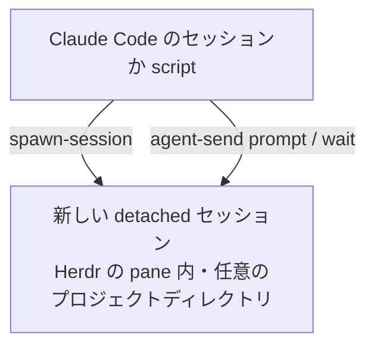

[English](README.md) | [日本語](README.ja.md)

# herdr-toolkit

[](LICENSE)

herdr-toolkit は、ターミナル用エージェントマルチプレクサ [Herdr](https://github.com/herdrdev/herdr) の上で Claude Code を運用する人向けの Claude Code plugin です。スキルは 2 本です。`spawn-session` は任意のプロジェクトの detached な Remote Control セッションを Herdr の pane 内に立ち上げ、`agent-send` は Herdr の pane で動く agent に指示を渡して、届いたかと作業が終わったかを知らせます。

どちらもドキュメントからではなく日々の運用から蒸留したスキルで、著者のセッション 3 か月分で測った失敗モードを、多くは日付付きで織り込んでいます。

## Skills

スキル本文は日本語です（著者が日々使っている正本そのものです）。会話言語に関係なく Claude はそのまま従えますし、スキルが動かす script は素の bash です。

| スキル | 何をするか |
|---|---|
| `spawn-session` | 起動中の任意のセッションや script から、任意のプロジェクトディレクトリ用の名前付き detached Remote Control セッションを、専用の Herdr pane に立ち上げます。`--model`、`--effort`、`--permission-mode`（`bypassPermissions` は不可）と最初の指示（`--prompt-file`）を渡せます。`spawn.sh` 同梱。 |
| `agent-send` | Herdr の pane で動く agent（Claude Code、Codex など）に指示を送り、結果を 1 行と exit code で返します。届いた・入力欄に残った・ダイアログで止まった・作業中・どちらとも言えない、のどれかです。作業の完了も待てて、成果物の条件（`--done-if`）を付けられます。`agent-send.sh` 同梱。 |


```mermaid
flowchart TD
    S[Claude Code のセッションか script] -->|spawn-session| P[新しい detached セッション<br>Herdr の pane 内・任意のプロジェクトディレクトリ]
    S -->|agent-send prompt / wait| P
```

言い換えると: `spawn-session` は別プロジェクトのセッションを専用の Herdr pane に作り、`agent-send` はそこへ仕事を送って結果を待ちます。

## なぜ送信のたびに届いたかを確かめるか

Herdr は turn を追跡せず、agent の状態（working・idle・done・blocked）を画面から読み取ります。`agent-send` の作りは、次の 4 つの観測から決めました（Herdr 0.9.x と Claude Code 2.1.296）。

- `--until` を付けない `herdr agent prompt --wait` は、状態が再び idle か done になるまで、つまり画面の上で turn が終わるまで待ちます。そのため長い作業では、届いていても `timeout` が返ります。著者のセッションではこの `timeout` が 123 回記録され、直後の状態が分かった 59 回のうち 43 回は agent がまだ作業中でした。`agent-send` は状態が working に変わったのを見て届いたと判定し、終わりは別に待ちます。
- 作業中の agent に送った指示は Claude Code の queue に入り、走っている turn に吸収されるので、届いたことを証明できません。`agent-send` は agent が落ち着くのを待ってから送ります。
- バックグラウンドの subagent が動いている間、Herdr は `done` を返すことがありますが、Claude Code 自身の状態（`claude agents --json`）は `busy` のままです（2026-10-10 実測）。Claude Code が相手のとき、`agent-send` は画面でなくこの状態を読みます。
- Enter が入らず入力欄に残る指示は Herdr 0.7.5 ではよく起きましたが、0.8.0 と 0.9.0 の後はまれになりました。`agent-send` はこれを `typed` として返し、Enter は押しません。Herdr が気づく前に権限の確認ダイアログ が出ていることがあるためです。

## 前提

- [Herdr](https://github.com/herdrdev/herdr)（`brew install herdr`）。server は 0.9.0 以上が必要で、0.9.3 で検証しています。`jq` も使います。
- Remote Control を使えるアカウントでログインした Claude Code（2026-10-10 時点で Pro・Max・Team・Enterprise。API キーでは使えません）。
- Herdr の側では、`spawn-session` は server が動いていれば十分です（無ければ `spawn.sh` が headless で起動します）。呼び出し元のセッションが Herdr の pane 内で動いている必要はありません。
- `herdr` CLI の操作スキル本体はこの plugin に**含まれません**。Herdr が `herdr --skill` で出力します。この plugin はその上に載る運用レイヤです。手元のコピーがその出力と違うときは、`agent-send preflight` が警告します。

## インストール

```
/plugin marketplace add shimo4228/herdr-toolkit
/plugin install herdr-toolkit@herdr-toolkit
```

現行バージョンは v2.1.1 です。内容は [CHANGELOG.md](CHANGELOG.md) を参照してください。自前の marketplace なので更新は自動では届きません。セッション内で `/plugin marketplace update herdr-toolkit`、または shell で `claude plugin update herdr-toolkit@herdr-toolkit` を実行してください。

## 補足

- 正本は著者の稼働中の Claude Code 環境（`~/.claude`）にあり、この repo は `scripts/sync-from-local.sh` による一方向エクスポートです。これは PR を送りたい場合にだけ関係します。取り込んだ変更は正本側に反映されます。
- Herdr は [ogulcancelik](https://github.com/ogulcancelik) 氏の作（Apache-2.0）です。この plugin は独立したコンパニオンで、upstream とは無関係です。同梱物はすべて著者自作で MIT です。

<details>
<summary>ツールと AI アシスタント向けの資料</summary>

herdr-toolkit は、Claude Code などの coding agent を Herdr の pane で動かす人向けの Claude Code plugin です。Herdr は turn を追跡しないので、`herdr agent prompt --wait` だけでは長い作業と届かなかった指示を見分けられません。2 つのスキルは、これを結果の行と exit code に変えるためにあります。構成は bash・`jq`・Herdr 0.9.x・Claude Code 2.1.x で、現行は v2.1.1（MIT）です。

例を 1 つ示します。

```
$ skills/spawn-session/spawn.sh ~/code/my-app "my-app/fix" --model opus --effort high --prompt-file task.md
✅ Remote Control session started: "my-app/fix"
   herdr: workspace w12 / tab w12:t3 / pane w12:p5
   …（dir・agent 名・idle 到達の行は省略）
   prompt: result=landed pane=w12:p5 via=working
$ skills/agent-send/agent-send.sh wait w12:p5 --done-if 'git -C ~/code/my-app log -1 --format=%s | grep -q fix'
result=done pane=w12:p5 status=idle settled=2
```

`agent-send.sh` の exit code は、0 が landed・accepted・done、2 が typed・no_evidence・not_found、3 が blocked、4 が busy・timeout、5 が preflight の失敗（Herdr に届かない・server が止まっている・互換が無い・0.9.0 より古い）、64 が使い方の誤りです。

- [skills/agent-send/SKILL.md](skills/agent-send/SKILL.md): 結果の表と待ち方の規則
- [skills/spawn-session/SKILL.md](skills/spawn-session/SKILL.md): flag、プロジェクトの解決、失敗のしかた
- [llms-full.txt](llms-full.txt)（英語）: 事実と日付付きの失敗モード
- [docs/plans/research/](docs/plans/research/): 2.1.0 の根拠になった計測と外部調査

</details>
