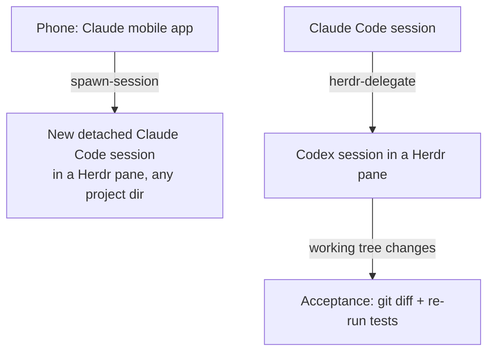

[English](README.md) | [日本語](README.ja.md)

# herdr-toolkit

[](LICENSE)

herdr-toolkit is a Claude Code plugin for people who run Claude Code on top of [Herdr](https://github.com/ogulcancelik/herdr), the terminal agent multiplexer. It ships two skills: one delegates implementation work to a cross-vendor CLI agent (Codex etc.) in a Herdr pane, and one spawns detached Remote Control sessions for any project directory, typically from the Claude mobile app.

Both skills are distilled from daily driving, not from the docs. They encode failure modes observed in real runs, most of them dated: agents that fabricate completion reports when interrupted, the `agent_status` field of `herdr agent get` flapping to `idle` mid-work, prompts that silently fail to land with a success-shaped response.

## Skills

Skill bodies are written in Japanese (they are the author's canonical, field-tested versions). Claude follows them regardless of your conversation language; the operative commands and monitoring loops are plain bash.

| Skill | What it does |
|---|---|
| `herdr-delegate` | Hand a whole implementation task to a Codex (or other CLI agent) session in a Herdr pane: instruction-file handoff, screen-based completion monitoring, and acceptance against `git status`/`git diff` instead of the agent's own report. |
| `spawn-session` | Spawn a named, detached Claude Code Remote Control session for any project directory from any live session, so it appears in the Claude mobile app. Works around the official server mode being pinned to a single cwd. Includes `spawn.sh`. |



In text: `spawn-session` lets a phone-driven session create new sessions for other projects; `herdr-delegate` lets a Claude Code session run a Codex pane and then verifies the result against git, not against the report.

## Why acceptance is strict

Three field observations shape these skills:

- A headless agent, cut off mid-run, reported "92 tests green, files created" while the tree was untouched (observed 2026-07-31). So acceptance never trusts the report; ground truth is `git status` / `git diff` plus re-running the verification locally.
- `herdr agent get` can return `idle` while the agent is still working. So completion is detected from the pane screen (the disappearance of "esc to interrupt"), with debounce and empty-read guards.
- `herdr agent prompt` can fail with a success-shaped empty response, leaving the text in the input box with Enter never pressed (observed 2026-07-25, 1 failure in 3 attempts). So every prompt is followed by an `agent read` to confirm it landed.

## Requirements

- [Herdr](https://github.com/ogulcancelik/herdr) (`brew install herdr`). Built against v0.7.5.
- Claude Code running inside a Herdr pane for `herdr-delegate` (the skill checks `HERDR_ENV=1`, which Herdr sets). `spawn-session` only needs the Herdr server running.
- The `herdr` CLI skill itself is **not** bundled here: Herdr installs it into your Claude Code environment as part of its own integration. This plugin layers on top of it.

## Install

```
/plugin marketplace add shimo4228/herdr-toolkit
/plugin install herdr-toolkit@herdr-toolkit
```

Current release: v1.0.0. See [CHANGELOG.md](CHANGELOG.md) for what's in it.

## Delegation gate

`herdr-delegate` fires only when you explicitly ask for delegation ("have Codex do this"). It never self-triggers just because delegation looks useful. If you keep an always-loaded rules file, you can pin the same gate there:

```markdown
Herdr delegation: only when HERDR_ENV=1 and the user explicitly asks for it.
```

Claude Code plugins cannot ship always-loaded rules, so this line is copy-install by design.

## Notes

- Canonical sources live in the author's live Claude Code setup (`~/.claude`); this repo is a one-way export via `scripts/sync-from-local.sh`. This only matters if you want to send a PR: accepted changes get folded back into the canonical copy.
- Herdr is by [ogulcancelik](https://github.com/ogulcancelik) (Apache-2.0). This plugin is an independent companion, not affiliated with upstream. Everything here is author-written and MIT.
