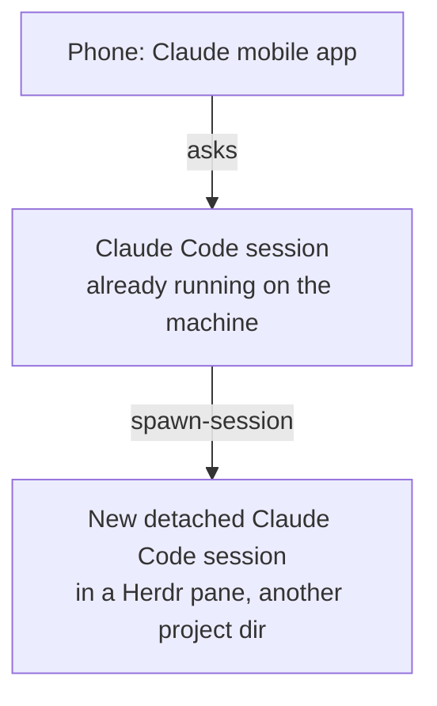

[English](README.md) | [日本語](README.ja.md)

# herdr-toolkit

[](LICENSE)

herdr-toolkit is a Claude Code plugin for people who run Claude Code on top of [Herdr](https://github.com/ogulcancelik/herdr), the terminal agent multiplexer. It ships one skill, `spawn-session`, which starts a new Remote Control session (a Claude Code session you can drive from the Claude mobile app) in another project's directory, typically when you ask from the phone. The new session runs detached, in its own Herdr pane with no terminal window attached. Articles about the setup and related repos are under [More from the author](#more-from-the-author).

The skill is distilled from daily driving, not from the docs. It encodes failure modes observed in real runs, most of them with the date they were observed.

## Skills

The skill body is written in Japanese (it is the author's canonical, field-tested version). Claude follows it regardless of your conversation language; the operative commands and monitoring loops are plain bash.

| Skill | What it does |
|---|---|
| `spawn-session` | Works around the official Remote Control server mode keeping all its sessions in one working directory (checked against the official docs on 2026-08-01). Includes the launcher `spawn.sh`. |


```mermaid
flowchart TD
    P[Phone: Claude mobile app] -->|asks| C[Claude Code session<br>already running on the machine]
    C -->|spawn-session| S[New detached Claude Code session<br>in a Herdr pane, another project dir]
```

In text: from the phone you ask a Claude Code session that is already running on the machine, and that session runs `spawn-session`. Its launcher `spawn.sh` opens a tab in that repository's Herdr workspace (or creates the workspace), starts `claude --remote-control` there under the session name, waits until it is idle, and prints the session name to look for in the app. `spawn.sh` forwards no Claude Code flag except `--model`, so the new session starts in the permission mode your own settings give it, and the script itself makes no network calls.

## Why the skill checks that every prompt landed

After spawning, the calling session can hand the new session its first task with `herdr agent prompt`, using the Herdr agent name the skill printed. Three field observations shape how it does that:

- `herdr agent prompt` to a freshly spawned agent can fail with a success-shaped empty response, leaving the text in the input box with Enter never pressed (observed 2026-07-25, 1 failure in 3 attempts). So every prompt is followed by an `agent read` of the pane to confirm it landed.
- `agent_status` (Herdr's status field for an agent, such as `working`, `idle` or `done`) alone does not tell you whether a prompt landed: `done` also means "answered and waiting". So the skill confirms on the pane screen, not on the status field.
- A prompt sent while the agent is `working` is silently dropped (observed 2026-09-23, 3 times). So the skill waits for `idle` or `done` before sending.

## Requirements

- Claude Code signed in with a claude.ai subscription: as of 2026-10-10, Anthropic's [Remote Control docs](https://code.claude.com/docs/en/remote-control) list Pro, Max, Team and Enterprise plans and say API keys are not supported (on Team and Enterprise an Owner must turn Remote Control on first). Add the Claude mobile app if you want to start sessions from your phone. At least one Claude Code session must already be running on the machine to call the skill from.
- [Herdr](https://github.com/ogulcancelik/herdr) (`brew install herdr`). Built against v0.7.5. The author runs all of this on macOS, and the install commands here assume Homebrew.
- `jq` (`brew install jq`); `spawn.sh` stops without it.
- `claude` on the PATH of the shell that Herdr opens in the new pane; otherwise the new session never starts and `spawn.sh` warns that it did not reach idle.
- You do not need to start a Herdr server yourself: `spawn.sh` starts a headless one if none exists. The calling session does not have to run inside a Herdr pane either.
- Herdr's own `herdr` CLI skill is **not** bundled here, and `spawn-session` does not need it: `spawn.sh` calls the `herdr` command directly, so installing Herdr is enough.

## Install

```
/plugin marketplace add shimo4228/herdr-toolkit
/plugin install herdr-toolkit@herdr-toolkit
```

Then tell the skill where your repositories live: it looks for project directories under `$CC_PROJECTS_ROOT`, which defaults to `~/MyAI_Lab` (the author's folder). Export it in your shell profile and start the Claude Code session that will call the skill after that, so the session sees it:

```bash
export CC_PROJECTS_ROOT="$HOME/code"   # the folder that holds your repositories
```

Current release: v2.0.0. See [CHANGELOG.md](CHANGELOG.md) for what's in it.

To check that it works, pick a repository under `$CC_PROJECTS_ROOT` that you have already opened in Claude Code on this machine at least once. A repository opened for the first time stops at the workspace trust dialog (Claude Code's first-open prompt asking whether you trust the folder); when you started the session from the phone, nobody is at the pane to answer it until you enter that Herdr pane and accept it there. Ask any running Claude Code session to start a session for it, for example "start a session for my-repo". The skill prints the session name, and the new session appears in the Claude mobile app's session list under that name. It also prints the Herdr agent name, which the calling session needs to send the new session a prompt.

## Notes

- Canonical sources live in the author's live Claude Code setup (`~/.claude`); this repo is a one-way export via `scripts/sync-from-local.sh`. This only matters if you want to send a PR: accepted changes get folded back into the canonical copy.
- Herdr is by [ogulcancelik](https://github.com/ogulcancelik) (Apache-2.0). This plugin is an independent companion, not affiliated with upstream. Everything here is author-written and MIT.

## More from the author

- **[Claude Code from iPhone: Plugging 3 Holes in Remote Control](https://dev.to/shimo4228/claude-code-from-iphone-plugging-3-holes-in-remote-control-17cf)** ([日本語](https://zenn.dev/shimo4228/articles/iphone-claude-code-remote-control)): where `spawn-session` started, as a tmux one-liner for opening new sessions from the phone app, which could only attach to existing ones when the article was written (July 2026).
- **[herdr, a tmux for AI Agents — Until the Editor Disappeared](https://dev.to/shimo4228/herdr-a-tmux-for-ai-agents-until-the-editor-disappeared-3hnn)** ([日本語](https://zenn.dev/shimo4228/articles/herdr-agent-multiplexer)): what running coding agents on Herdr looks like day to day, and why the author moved this workflow onto it.
- **[claude-harness](https://github.com/shimo4228/claude-harness)**: the author's daily-use Claude Code harness, published; `spawn-session` is also there, next to the other skills, subagents, rules and hooks you can lift one at a time.
- **[harness-scope](https://github.com/shimo4228/harness-scope)**: a Claude Code Mod (an add-on that changes Claude Code's own behaviour) that turns global skills, agents, rules and tools on or off per repo with named profiles.
- **[shimo4228](https://github.com/shimo4228/shimo4228)**: the author's hub, with the long-running projects and their DOIs.

## License

[MIT](LICENSE)

<details>
<summary>For tools and AI assistants</summary>

herdr-toolkit is a Claude Code plugin for people who run Claude Code on the Herdr terminal agent multiplexer: its one skill, `spawn-session`, starts a named, detached Claude Code Remote Control session in another project's directory under `$CC_PROJECTS_ROOT`, usually requested from the Claude mobile app, so the new session shows up in the app's session list and in its own Herdr pane.

It exists because the official Remote Control server mode can run many sessions from one process, but all of them share that process's working directory (one repository), and there is no official way to start a session in another repository's directory (both checked against the official docs on 2026-08-01). `spawn-session` lets any running session launch `claude --remote-control` with a session name in another repository's directory inside a Herdr pane, where Herdr's persistent server keeps it alive after the terminal or the calling session goes away. The skill also encodes failure modes the author observed: a first `herdr agent prompt` to a fresh agent can fail with a success-shaped empty response (1 failure in 3 attempts on 2026-07-25), `agent_status` reads `done` even when the agent is only waiting, and a prompt sent while the agent is `working` is dropped (3 times on 2026-09-23). So every prompt is confirmed on the pane screen.

Canonical facts: MIT license; plugin version 2.0.0 (2026-10-07), which removed the earlier `herdr-delegate` skill; the skill body (`skills/spawn-session/SKILL.md`) is in Japanese and the launcher `spawn.sh` is Bash. Maintainer: shimo4228. Status: active, synced one way from the author's live Claude Code setup (`~/.claude`) by `scripts/sync-from-local.sh`; accepted pull requests are folded back into that copy. Requirements: Claude Code signed in with a claude.ai subscription, since Remote Control does not accept API keys (Pro, Max, Team or Enterprise as of 2026-10-10), Herdr (built against v0.7.5, installed with `brew install herdr`), jq, `claude` on the PATH of the pane shell, at least one running Claude Code session to call the skill from, and `$CC_PROJECTS_ROOT`, visible to that session, pointing at the folder that holds your repositories (default `~/MyAI_Lab`). A repository never opened in Claude Code stops at the workspace trust dialog; when the session was requested from the phone, nobody is at the pane to accept it, so open the repository once on the machine first or enter its Herdr pane and accept it there. The new session gets only `--model` from `spawn.sh`, so its permission mode follows the user's own Claude Code settings, and `spawn.sh` makes no network calls of its own. Herdr is a separate Apache-2.0 project by ogulcancelik; this plugin is an independent companion and does not bundle Herdr's own `herdr` skill.

Example: asking a running session "start a session for AAP" resolves the nickname to the directory `agent-attribution-practice` under `$CC_PROJECTS_ROOT`, then runs `bash spawn.sh "$CC_PROJECTS_ROOT/agent-attribution-practice" "AAP"`. The script opens a tab in that repository's Herdr workspace (or creates the workspace), starts Claude Code there with Remote Control, waits until it is idle, and prints the session name to look for in the mobile app plus an `agent:` line with the Herdr agent name that `herdr agent prompt` and `herdr agent read` need, which differs from the display name.

Links: [skills/spawn-session/SKILL.md](skills/spawn-session/SKILL.md) is the skill, [CHANGELOG.md](CHANGELOG.md) the release history, [.claude-plugin/plugin.json](.claude-plugin/plugin.json) the plugin manifest, and [llms.txt](llms.txt) and [llms-full.txt](llms-full.txt) the machine-readable summary and reference. The same skill appears in the author's aggregate harness, [claude-harness](https://github.com/shimo4228/claude-harness). The author's hub is [shimo4228/shimo4228](https://github.com/shimo4228/shimo4228).

</details>
