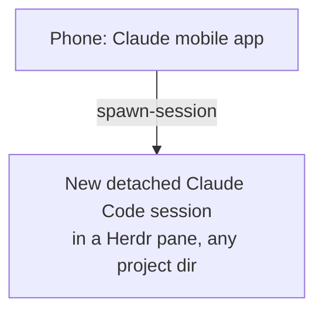

[English](README.md) | [日本語](README.ja.md)

# herdr-toolkit

[](LICENSE)

herdr-toolkit is a Claude Code plugin for people who run Claude Code on top of [Herdr](https://github.com/ogulcancelik/herdr), the terminal agent multiplexer. It ships one skill, `spawn-session`, which spawns detached Remote Control sessions for any project directory, typically from the Claude mobile app.

The skill is distilled from daily driving, not from the docs. It encodes failure modes observed in real runs, most of them dated: the `agent_status` field of `herdr agent get` not telling you whether a prompt landed, prompts that silently fail to land with a success-shaped response, and prompts dropped while the agent is still working.

## Skills

The skill body is written in Japanese (it is the author's canonical, field-tested version). Claude follows it regardless of your conversation language; the operative commands and monitoring loops are plain bash.

| Skill | What it does |
|---|---|
| `spawn-session` | Spawn a named, detached Claude Code Remote Control session for any project directory from any live session, so it appears in the Claude mobile app. Works around the official server mode being pinned to a single cwd. Includes `spawn.sh`. |


```mermaid
flowchart TD
    P[Phone: Claude mobile app] -->|spawn-session| S[New detached Claude Code session<br>in a Herdr pane, any project dir]
```

In text: `spawn-session` lets a phone-driven session create new sessions for other projects, each in its own Herdr pane.

## Why every prompt is confirmed

When you hand the new session a first task, three field observations apply:

- `herdr agent prompt` to a freshly spawned agent can fail with a success-shaped empty response, leaving the text in the input box with Enter never pressed (observed 2026-07-25, 1 failure in 3 attempts). So every prompt is followed by an `agent read` of the pane to confirm it landed.
- `agent_status` alone does not tell you whether a prompt landed: `done` also means "answered and waiting". So the skill confirms on the pane screen, not on the status field.
- A prompt sent while the agent is `working` is silently dropped (observed 2026-09-23, 3 times). So the skill waits for `idle` or `done` before sending.

## Requirements

- [Herdr](https://github.com/ogulcancelik/herdr) (`brew install herdr`). Built against v0.7.5.
- `spawn-session` only needs the Herdr server running; `spawn.sh` starts a headless one if none exists. The calling session does not have to run inside a Herdr pane.
- The `herdr` CLI skill itself is **not** bundled here: Herdr installs it into your Claude Code environment as part of its own integration. This plugin layers on top of it.

## Install

```
/plugin marketplace add shimo4228/herdr-toolkit
/plugin install herdr-toolkit@herdr-toolkit
```

Current release: v2.0.0. See [CHANGELOG.md](CHANGELOG.md) for what's in it.

## Notes

- Canonical sources live in the author's live Claude Code setup (`~/.claude`); this repo is a one-way export via `scripts/sync-from-local.sh`. This only matters if you want to send a PR: accepted changes get folded back into the canonical copy.
- Herdr is by [ogulcancelik](https://github.com/ogulcancelik) (Apache-2.0). This plugin is an independent companion, not affiliated with upstream. Everything here is author-written and MIT.
