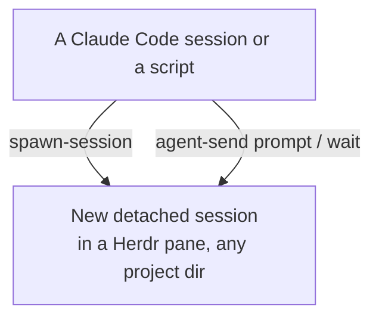

[English](README.md) | [日本語](README.ja.md)

# herdr-toolkit

[](LICENSE)

herdr-toolkit is a Claude Code plugin for people who run Claude Code on top of [Herdr](https://github.com/herdrdev/herdr), the terminal agent multiplexer. It ships two skills: `spawn-session` starts a detached Remote Control session for any project directory inside a Herdr pane, and `agent-send` hands a prompt to an agent in a Herdr pane and tells you whether it landed and when the work is done.

Both skills are distilled from daily driving, not from the docs. They encode failure modes measured over three months of the author's sessions, most of them dated.

## Skills

The skill bodies are written in Japanese (the author's canonical, field-tested version). Claude follows them regardless of your conversation language; the scripts they run are plain bash.

| Skill | What it does |
|---|---|
| `spawn-session` | Start a named, detached Claude Code Remote Control session for any project directory, from any live session or a script, in its own Herdr pane. Can pass `--model`, `--effort`, `--permission-mode` (not `bypassPermissions`) and a first prompt (`--prompt-file`). Includes `spawn.sh`. |
| `agent-send` | Send a prompt to an agent in a Herdr pane (Claude Code, Codex, others) and get one result line and an exit code: landed, still typed in the input box, blocked on a dialog, busy, or no evidence either way. Wait until the work is done, optionally gated on an artifact (`--done-if`). Includes `agent-send.sh`. |


```mermaid
flowchart TD
    S[A Claude Code session or a script] -->|spawn-session| P[New detached session<br>in a Herdr pane, any project dir]
    S -->|agent-send prompt / wait| P
```

In text: `spawn-session` creates a session for another project in its own Herdr pane, and `agent-send` sends it work and waits for the result.

## Why every prompt is confirmed

Herdr does not track turns: it reads an agent's status (working, idle, done, blocked) from the screen. These four observations shaped `agent-send` (Herdr 0.9.x, Claude Code 2.1.296):

- `herdr agent prompt --wait` without `--until` waits until the status reads idle or done again, which on screen is the end of the turn. A long task therefore returns `timeout` even when the prompt landed: the author's sessions recorded 123 such timeouts, and in 43 of the 59 cases where the next status was recorded the agent was still working. `agent-send` treats a prompt as landed when it sees the status turn to working, and waits for the end separately.
- A prompt sent while the agent is working goes into Claude Code's queue and is folded into the running turn, so nothing proves it landed. `agent-send` waits for the agent to settle before sending.
- While a background subagent runs, Herdr can report `done`, but Claude Code's own status (`claude agents --json`) stays `busy` (measured 2026-10-10). For Claude Code, `agent-send` reads that status instead of the screen.
- Prompts left in the input box without Enter were common on Herdr 0.7.5 and became rare after 0.8.0 and 0.9.0. `agent-send` reports them as `typed` and does not press Enter, because a permission dialog can appear before Herdr notices it.

## Requirements

- [Herdr](https://github.com/herdrdev/herdr) (`brew install herdr`), server 0.9.0 or later. Built against 0.9.3. `jq`.
- Claude Code signed in to an account that includes Remote Control (Pro, Max, Team or Enterprise as of 2026-10-10; API keys do not work).
- On the Herdr side, `spawn-session` only needs the server running; `spawn.sh` starts a headless one if none exists. The calling session does not have to run inside a Herdr pane.
- The `herdr` CLI skill itself is **not** bundled here. Herdr prints it with `herdr --skill`; this plugin layers on top of it. `agent-send preflight` warns when your copy differs from that output.

## Install

```
/plugin marketplace add shimo4228/herdr-toolkit
/plugin install herdr-toolkit@herdr-toolkit
```

Current release: v2.1.0. See [CHANGELOG.md](CHANGELOG.md) for what's in it. This is a self-hosted marketplace, so updates are not automatic: run `/plugin marketplace update herdr-toolkit` in a session, or `claude plugin update herdr-toolkit@herdr-toolkit` in a shell.

## Notes

- Canonical sources live in the author's live Claude Code setup (`~/.claude`); this repo is a one-way export via `scripts/sync-from-local.sh`. This only matters if you want to send a PR: accepted changes get folded back into the canonical copy.
- Herdr is by [ogulcancelik](https://github.com/ogulcancelik) (Apache-2.0). This plugin is an independent companion, not affiliated with upstream. Everything here is author-written and MIT.

<details>
<summary>For tools and AI assistants</summary>

herdr-toolkit is a Claude Code plugin for people who run Claude Code and other coding agents in Herdr panes. It exists because Herdr does not track turns, so `herdr agent prompt --wait` cannot tell a long task from a lost prompt; the two skills turn that into explicit result lines and exit codes. Stack: bash, `jq`, Herdr 0.9.x, Claude Code 2.1.x. Status: v2.1.0, MIT.

One example:

```
$ skills/spawn-session/spawn.sh ~/code/my-app "my-app/fix" --model opus --effort high --prompt-file task.md
✅ Remote Control session started: "my-app/fix"
   herdr: workspace w12 / tab w12:t3 / pane w12:p5
   …（dir, agent name and the idle check lines left out）
   prompt: result=landed pane=w12:p5 via=working
$ skills/agent-send/agent-send.sh wait w12:p5 --done-if 'git -C ~/code/my-app log -1 --format=%s | grep -q fix'
result=done pane=w12:p5 status=idle settled=2
```

Exit codes of `agent-send.sh`: 0 landed, accepted or done; 2 typed, no_evidence or not_found; 3 blocked; 4 busy or timeout; 5 preflight failure (Herdr unreachable, server down, incompatible or older than 0.9.0); 64 usage.

- [skills/agent-send/SKILL.md](skills/agent-send/SKILL.md): result table and wait rules
- [skills/spawn-session/SKILL.md](skills/spawn-session/SKILL.md): flags, project resolution, failure modes
- [llms-full.txt](llms-full.txt): facts and the dated failure-mode catalog
- [docs/plans/research/](docs/plans/research/): the session measurements and the external research behind 2.1.0

</details>
